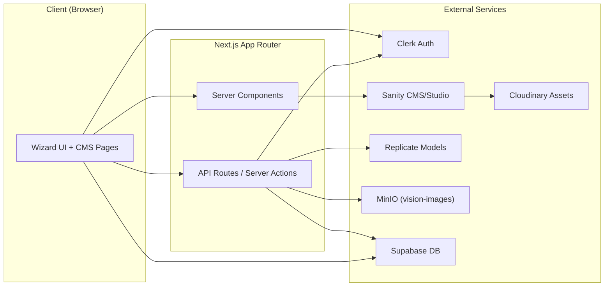
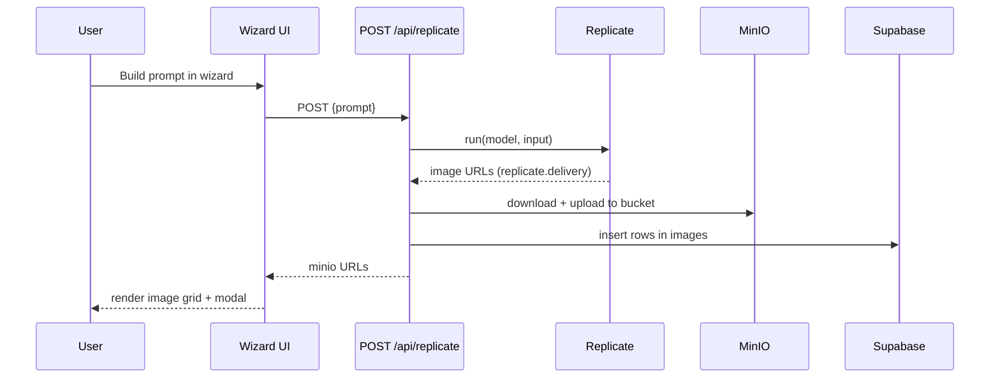
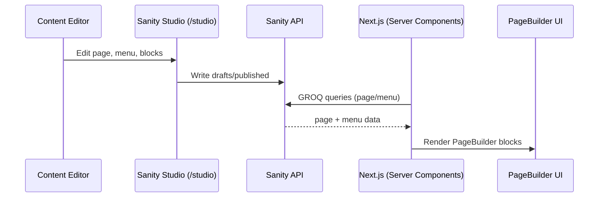

# AGENTS.md — RDDOT-dfn-AI-IMAGEGEN

## Purpose
This repo is a Next.js 15 App Router web app for generating AI kitchen images. It combines a Sanity CMS-driven marketing site with a client-side wizard that builds prompts, calls Replicate for image generation and upscaling, stores assets in MinIO, and records metadata in Supabase. Auth is handled by Clerk, and the UI is fully localized with `next-intl`.

## Tech Stack
- Next.js 15 (App Router, React 19, TypeScript)
- Tailwind CSS v4 (via `@import "tailwindcss"` in `app/globals.css`)
- Motion (`motion/react`) for animation
- `next-intl` for internationalization
- Clerk for auth/session
- Supabase for metadata storage (`images`, `users` tables)
- MinIO for image object storage (bucket `vision-images`)
- Replicate API for image generation and upscaling
- Sanity CMS + Studio (embedded at `/studio`) with Cloudinary plugin and document internationalization
- shadcn/ui + Radix UI primitives

## Quick Commands
- `pnpm install`
- `pnpm dev` (uses Turbopack)
- `pnpm build`
- `pnpm lint` / `pnpm fix`

## Environment Variables
See `.env.local.example` for the complete list. Required keys used in code:
- Replicate: `REPLICATE_API_TOKEN`
- MinIO: `MINIO_DOMAIN`, `MINIO_ACCESS_KEY`, `MINIO_SECRET_KEY`
- Supabase: `NEXT_PUBLIC_SUPABASE_URL`, `NEXT_PUBLIC_SUPABASE_ANON_KEY`, `SUPABASE_SERVICE_ROLE_KEY`
- Clerk: `NEXT_PUBLIC_CLERK_PUBLISHABLE_KEY`, `CLERK_SECRET_KEY`
- Sanity: `NEXT_PUBLIC_SANITY_PROJECT_ID`, `NEXT_PUBLIC_SANITY_DATASET`, `NEXT_PUBLIC_SANITY_API_VERSION`, `NEXT_PUBLIC_SANITY_STUDIO_URL`, `SANITY_VIEWER_TOKEN`, `SANITY_STUDIO_PREVIEW_ORIGIN`

## App Structure
- `app/`
  - `(site)/[locale]/page.tsx`: Home route, pulls Sanity `HOME_PAGE_QUERY` and renders `PageBuilder`.
  - `(site)/[locale]/[slug]/page.tsx`: Generic CMS page route, uses `PAGE_QUERY`.
  - `(site)/[locale]/my-images/page.tsx`: Auth-protected gallery page.
  - `(studio)/studio/[[...tool]]/page.tsx`: Sanity Studio.
  - `api/replicate/route.ts`: Generate images via Replicate and persist to MinIO + Supabase.
  - `api/replicate/upscale/route.ts`: Upscale image via Replicate and persist.
  - `api/clerk-user-webhook/route.ts`: Upserts users into Supabase.
  - `api/draft-mode/enable/route.ts`: Enables Sanity preview/draft mode.
  - `store/*`: nanostores for wizard flow and translation map.
- `components/`
  - `PageBuilder.tsx`: Maps Sanity `content` blocks to React components.
  - `wizard/*`: Prompt wizard flow and image generation UX.
  - `ui/*`: Navbar, footer, shadcn/radix UI primitives.
- `sanity/`
  - `schemaTypes/*`: CMS types including `page`, `menu`, and page-builder blocks.
  - `lib/queries.ts`: GROQ queries for page + menu data.
  - `structure.ts`: Custom Studio desk structure.
- `i18n/`: `next-intl` config and routing.
- `messages/`: Locale JSON files (`de`, `en`).
- `lib/`: Supabase helpers, MinIO client, server actions.
- `public/`: Fonts, UI assets, lottie animations.

## UI System
- Global styles are defined in `app/globals.css` with a dark, high-contrast palette.
- Primary fonts are Raleway (multiple weights included under `public/fonts`).
- Brand colors are exposed as Tailwind theme variables (e.g. `--color-brand-primary-2`).
- Animation is mostly via `motion/react` and Lottie loaders.
- Layout: a CMS-driven page builder for marketing pages and a wizard for image creation.

## UI Anatomy
UI entry points:
- Home and CMS pages: `app/(site)/[locale]/page.tsx`, `app/(site)/[locale]/[slug]/page.tsx`
- Wizard flow container: `components/wizard/Wizard.tsx`
- Image generation UI: `components/wizard/ImageGenerator.tsx`
- Image viewer + actions: `components/ImageModal.tsx`, `components/UpscaleModal.tsx`
- Gallery page: `app/(site)/[locale]/my-images/page.tsx`, `components/ImagesGalleryClient.tsx`

Page-builder blocks:
- Registry: `components/PageBuilder.tsx`
- Block components: `components/pagebuildercomponents/*`

Navigation and chrome:
- Navbar + language switcher: `components/ui/navbar.tsx`, `components/ui/LanguageSwitcher.tsx`
- Footer: `components/ui/Footer.tsx`

State and data flow (client):
- Wizard and modal state: `app/store/*` (nanostores)
- React Query client: `app/get-query-client.ts`, `components/Providers.tsx`

## Architecture Diagrams

### Image Generation Flow

### CMS Content Flow

## Key Workflows

### 1) CMS-driven Pages
- Sanity Studio runs at `/studio` using `next-sanity`.
- The `page` type stores `content` as a `pageBuilder` array.
- `components/PageBuilder.tsx` renders each block (header, hero, ticker, wizard, etc.).
- Navbar/Footer are CMS `menu` documents and fetched per-locale.
- Draft/visual editing is enabled via `next-sanity` live mode and `/api/draft-mode/enable`.

### 2) Localization
- Locales: `de`, `en` with `localePrefix: 'always'`.
- Messages are loaded from `messages/<locale>.json`.
- Translation slugs are resolved via Sanity `translation.metadata` in GROQ queries.
- `TranslationSetter` writes slug mappings into a nanostore for UI use.

### 3) Image Generation
- Entry: `Wizard` -> `ImageGenerator`.
- `ImageGenerator` uses React Query + `fetch('/api/replicate')`.
- Server route:
  - Validates Clerk session.
  - Calls Replicate model `mainframeai/rddt-finetune-dec-2025`.
  - Uploads outputs to MinIO (`lib/minioClient.ts`).
  - Inserts rows into Supabase `images` table.
- Result: URLs are returned to the UI and displayed in a grid with modal controls.

### 4) Upscaling
- `ImageModal` opens `UpscaleModal`.
- `UpscaleModal` calls `/api/replicate/upscale`.
- Outputs are stored in MinIO and inserted into Supabase with `is_upscaled = true` and `original_image_url`.

### 5) My Images Gallery
- Route: `/[locale]/my-images`.
- Requires Clerk auth; redirects to `/sign-in` when unauthenticated.
- Uses server action `lib/actions/images.ts` + `useInfiniteQuery`.

## Data & Storage
- Supabase tables in use:
  - `images`: `id`, `user_id`, `url`, `created_at`, `imageprompt`, `is_upscaled`, `original_image_url`.
  - `users`: populated by Clerk webhook.
- MinIO bucket: `vision-images`.
- Sanity assets can be stored via Cloudinary plugin.

## Next.js & Tooling Notes
- `next.config.ts` defines remote image domains for Replicate, MinIO, and Cloudinary.
- `middleware.ts` combines Clerk and `next-intl` routing.
- `@/*` path alias maps to repo root; `@/store/*` maps to `app/store/*`.

## Common Change Points
- Adding a new CMS block:
  - Add schema in `sanity/schemaTypes`.
  - Register it in `sanity/schemaTypes/pageBuilderType.ts`.
  - Add React component and map in `components/PageBuilder.tsx`.
- Updating models or parameters:
  - Change in `app/api/replicate/route.ts` or `app/api/replicate/upscale/route.ts`.
- Styling updates:
  - Use `app/globals.css` Tailwind v4 tokens and CSS variables.

## Deployment
- README states automated Jenkins deploys on `main` to `https://rotpunkt-visions.de/` within ~2 minutes.

## Testing
- No test suite configured in repo. Use `pnpm lint` for static checks.
