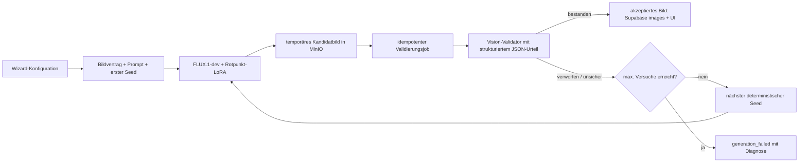

# Stabilisierung-Playbook: visuelle Qualitätsprüfung

**Status:** geplant – keine Implementierung in diesem Schritt
**Ziel:** Generierte Küchenbilder erst dann als gültig anzeigen und dauerhaft als Ergebnis speichern, wenn sie die fachlichen Bildregeln erfüllen. Das ergänzt das bestehende FLUX.1-dev-LoRA und vermeidet ein erneutes LoRA-Training.

## 1. Ausgangslage und Grundsatz

Prompting kann die Wahrscheinlichkeit korrekter Küchen erhöhen, aber keine Objektanzahl, Topologie oder Montagebeziehung garantieren. FLUX kann trotz eines korrekten Prompts zusätzliche Armaturen, zusätzliche Spülbecken oder weitere Küchenzonen erzeugen.

Die Stabilisierung erfolgt daher **nach** der Bildgenerierung:

1. FLUX erzeugt einen Kandidaten.
2. Ein visueller Validator prüft den Kandidaten gegen die für diesen Auftrag gültigen Regeln.
3. Nur ein bestandener Kandidat wird dem Nutzer angezeigt und als reguläres Bild gespeichert.
4. Nicht bestandene Kandidaten werden mit einem neuen, deterministischen Seed erneut erzeugt – bis zum festgelegten Limit.

Der feste Seed bleibt sinnvoll, weil Fehler reproduzierbar bleiben. Er ist jedoch kein Qualitätsmechanismus. Die erste Generierung verwendet weiterhin den Standardsamen; nur Wiederholungen erhalten eine nachvollziehbare, deterministische Seed-Folge.

## 2. Bildvertrag: aus Konfiguration werden prüfbare Regeln

Jede Generation erhält vor dem Start einen strukturierten Bildvertrag (`generation specification`). Er wird aus den Wizard-Daten erzeugt und ist die gemeinsame Quelle für Prompt, Validator und Protokoll.

Beispiele für harte Regeln:

- genau eine sichtbare Einzelspüle;
- genau eine sichtbare Armatur, der Spüle zugeordnet;
- genau ein Induktionskochfeld auf der vorgesehenen Insel;
- keine weitere Kücheninsel oder zweite Spül-/Kochzone;
- Griffe nur auf den zulässigen Möbelflächen, nicht über einer Türfuge und nicht beidseitig auf derselben Tür montiert;
- die gewählten FENIX- und Frontfarben sind als dominierende Oberflächen sichtbar;
- die gewählte Kameraperspektive wird eingehalten.

Für die künftige Option **Vogelperspektive** gilt explizit:

- schräg nach unten gerichtete Kamera von **45–60°**, Zielwert **50°**;
- keine orthografische oder senkrechte 90°-Draufsicht;
- Arbeitsplatte, Insel und wesentliche Fronten/Griffe bleiben lesbar.

Regeln werden in drei Klassen eingeteilt:

| Klasse | Beispiele | Folge bei Verstoß |
| --- | --- | --- |
| Hard fail | zweite Armatur, zweite Spüle, falsche Kameraart | Kandidat verwerfen und erneut generieren |
| Soft fail | Farbe nur schwach erkennbar, Griffbild unsicher | zunächst erneut generieren; für die Kalibrierung protokollieren |
| Information | Stil, Lichtstimmung, Detailhinweise | kein automatisches Verwerfen |

Die Regeln müssen je Preset und Kameraprofil bewusst eingeschränkt werden: Was außerhalb des Bildausschnitts liegen darf, darf der Validator nicht fälschlich als Fehler bewerten.

## 3. Zielarchitektur



Der Browser startet ausschließlich die Generation. Er entscheidet nie über ein Prüfergebnis, keine Wiederholung und keinen Abrechnungsvorgang. Diese Entscheidungen erfolgen serverseitig und idempotent.

## 4. Geplantes Datenmodell

Die künftige Migration bleibt additiv, damit bestehende Bilder und Konten unverändert bleiben.

### `generation_sets`

Eine Zeile pro Nutzerauftrag bzw. Bildsatz. Sie verbindet Konfiguration, Kandidaten und Ergebnis.

- `id`, `user_id`, `created_at`
- `generation_spec` (versioniertes JSON des Bildvertrags)
- `prompt_version`, `model_version`, `lora_version`
- `initial_seed`, `max_attempts`
- `status`: `pending`, `generating`, `validating`, `accepted`, `failed`
- `accepted_image_id` (nullable)

### `generation_validation_attempts`

Unveränderbares Prüfprotokoll pro Kandidat.

- `id`, `generation_set_id`, `attempt_number`, `seed`
- `candidate_object_key` bzw. zeitlich begrenzte Kandidat-URL
- `generator_prediction_id`, `validator_model`, `validator_prompt_version`
- `verdict`: `pass`, `fail`, `uncertain`
- `report` (strukturiertes JSON: Objektzahlen, Positionen, Kamera, Gründe)
- Laufzeiten, Kosten-/Nutzungsmetadaten, Zeitstempel

### Bestehende Tabelle `images`

Nur akzeptierte Nutzerbilder werden regulär darin referenziert. Ergänzende, nullable Felder wären `generation_set_id`, `validation_status` und `accepted_at`. Die bisherigen Zeilen bleiben gültig und werden als historische, nicht rückwirkend geprüfte Bilder behandelt.

Abgelehnte Kandidatdateien werden nicht dauerhaft als normale Galerie-Bilder geführt. Für Debugging und Kalibrierung gilt eine kurze, dokumentierte Aufbewahrungsfrist; das Prüfurteil bleibt ohne vollständiges Bild erhalten.

## 5. Asynchroner Ablauf

1. Die bestehende API legt einen `generation_set` mit Bildvertrag und erstem Seed an.
2. Replicate liefert den Kandidaten über einen signaturgeprüften Webhook oder über einen serverseitig überwachten Abschluss zurück.
3. Das Kandidatbild wird zunächst temporär in MinIO abgelegt.
4. Der Abschluss erzeugt einen idempotenten Queue-Job. Mehrfach zugestellte Webhooks dürfen keinen zweiten Versuch und keine zweite Abrechnung erzeugen.
5. Ein Worker ruft den Validator mit Bild und Bildvertrag auf und erwartet ausschließlich valides JSON.
6. Bei `pass` wird das Bild atomar akzeptiert, in `images` gespeichert und im UI freigegeben.
7. Bei `fail` oder einem nach Regeln behandelten `uncertain` startet der Worker den nächsten Versuch mit einem neuen Seed.
8. Nach dem letzten Versuch wird der Satz als fehlgeschlagen markiert. Der Nutzer erhält eine verständliche Wiederholen-Option; interne Diagnose bleibt nur in Entwicklung bzw. im Admin-Kontext sichtbar.

Für die Orchestrierung eignen sich Replicate-Webhooks plus eine serverseitige Queue. Supabase Queues/`pgmq` und eine geplante bzw. jobgetriggerte Edge Function sind eine passende, entkoppelte Umsetzung. Details: [Replicate Webhooks](https://replicate.com/docs/topics/webhooks/receive-webhook), [Supabase Queues](https://supabase.com/docs/guides/queues), [Scheduled Edge Functions](https://supabase.com/docs/guides/functions/schedule-functions).

## 6. Validator-Strategie

Der Validator ist austauschbar. Vor der Produktiventscheidung wird mindestens ein schneller und ein stärkerer Vision-Language-Model-Kandidat auf einem gelabelten Testsatz verglichen. Entscheidend ist nicht die allgemeine Bildbeschreibung, sondern die Trefferquote auf Küchen-Topologie und falsche Freigaben.

Der Validator erhält:

- das Bild;
- den versionierten Bildvertrag;
- eine kleine, präzise Prüfanweisung;
- ein JSON-Schema mit Objektanzahlen, räumlichen Beziehungen, Kamera-Urteil, Konfidenzen und Gründen.

Beispiel eines Prüfurteils:

```json
{
  "verdict": "fail",
  "confidence": 0.94,
  "checks": {
    "single_sink": { "passed": true, "observed": 1 },
    "single_faucet": { "passed": false, "observed": 2 },
    "single_cooktop": { "passed": true, "observed": 1 },
    "bird_eye_oblique": { "passed": true, "estimated_downward_angle": 51 }
  },
  "reasons": ["Two visible faucets were detected."]
}
```

Unklare Urteile dürfen nicht stillschweigend akzeptiert werden. Während der Kalibrierung werden sie protokolliert und manuell bewertet; im späteren Enforce-Modus werden sie wie ein Wiederholungsgrund behandelt oder über eine explizite, gemessene Konfidenzschwelle entschieden.

## 7. Deterministische Wiederholungsstrategie

- erster Versuch: bestehender Produktions-Seed `260805`;
- weitere Versuche: feste Folge, zum Beispiel `260806`, `260807`;
- maximal drei Generierungsversuche pro Auftrag;
- pro Versuch bleibt der Bildvertrag und der Prompt unverändert; nur der Seed wechselt;
- jeder Seed, Kandidat und Prüfgrund wird gespeichert.

Damit sind sowohl gute als auch schlechte Ergebnisse reproduzierbar. Eine spätere Änderung des Prompts oder Validators erhält eine neue Versionsnummer, statt alte Befunde zu überschreiben.

## 8. Nutzer- und Entwicklungsoberfläche

Produktion:

- zeigt nur akzeptierte Bilder;
- zeigt einen ruhigen Fortschrittsstatus wie „Küchenentwurf wird geprüft“;
- bei endgültigem Fehlschlag eine erneute Generierung, ohne interne Fehlergründe offenzulegen.

Entwicklung/Admin:

- zeigt alle Kandidaten, Seed, Prompt-/Validator-Version und Prüfbericht;
- erlaubt den Vergleich zwischen akzeptierten, verworfenen und unsicheren Kandidaten;
- erlaubt das Markieren von Validator-Fehlern für den künftigen Testsatz.

## 9. Sicherheit, Kosten und Aufbewahrung

- Replicate-Webhooks müssen signaturgeprüft werden.
- Der Validator erhält nur kurzlebige, signierte Objekt-URLs; keine MinIO- oder Supabase-Schlüssel im Browser.
- Service-Role-Zugriff bleibt auf den serverseitigen Worker beschränkt; RLS erlaubt Nutzern nur eigene akzeptierte Bilder und eigene Sätze zu lesen.
- Wiederholungen sind auf drei Generierungen und drei Validierungen begrenzt.
- Fehlgeschlagene Kandidaten werden nach der definierten Retention automatisch entfernt.
- Pro Satz werden Anzahl der Versuche, Validator-Laufzeit und Kosten gemessen.

## 10. Test- und Einführungsplan

1. Einen gelabelten Testsatz mit mindestens 50–100 repräsentativen Küchenbildern anlegen: korrekt, doppelte Armatur, doppelte/fehlende Spüle, falsche Kochfeldposition, Griffkonflikt, falsche Kamera.
2. Validator-Kandidaten gegen diesen Satz messen: insbesondere False Accepts bei Hard-Fail-Regeln.
3. Zuerst **Shadow Mode**: prüfen und protokollieren, aber noch nichts verwerfen.
4. Stichprobe der Shadow-Urteile manuell bewerten und Regeln/Schwellen kalibrieren.
5. Zunächst nur die eindeutigsten Regeln erzwingen: eine Armatur, eine Spüle, ein Kochfeld, Kameraprofil.
6. Danach Griff- und Farbprüfung kontrolliert hinzunehmen.
7. Rollout über Feature Flag je Umgebung; bei Problemen zurück auf reine Generierung, ohne bestehende Bilder oder Konten zu verändern.

Messgrößen:

- Hard-Fail-Quote vor und nach Gate;
- False-Accept-Rate des Validators;
- durchschnittliche Versuche bis Akzeptanz;
- Abbruchquote nach maximalen Versuchen;
- zusätzliche Kosten und Wartezeit pro akzeptiertem Bild;
- Nutzerbewertung akzeptierter Bilder.

## 11. Entscheidungen vor der Implementierung

- Welcher Validator gewinnt den Vergleich auf dem gelabelten Testsatz?
- Soll `uncertain` strikt wiederholen oder ab einer gemessenen Schwelle akzeptiert werden?
- Wie lange dürfen abgelehnte Kandidatbilder für Debugging aufbewahrt werden?
- Welche Hard-Fail-Regeln gelten pro Preset und pro Kamera?
- Soll nach endgültigem Fehlschlag automatisch noch ein neuer Satz gestartet werden, oder ausschließlich auf Nutzeraktion?
- Welche Kosten- und Wartezeitobergrenze ist pro Nutzerauftrag akzeptabel?

## 12. Nicht Bestandteil dieses Schritts

Dieses Playbook führt noch keine Datenbankmigration, keinen Webhook, keinen Worker, keinen Validator-Aufruf, keine Wiederholung und keine Änderung am LoRA durch. Es ist die freigegebene technische Leitlinie, auf deren Basis die spätere Implementierung in kleinen, rückrollbaren Schritten erfolgen kann.
