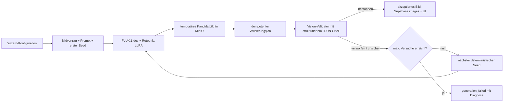

# Stabilisierung-Playbook: visuelle Qualitätsprüfung

**Status:** in Umsetzung – Shadow Mode läuft im Code, Enforce-Modus und Wiederholung stehen aus
**Stand:** 3. September 2026 – Schritt 0 (Abschnitt 2a), Schritt 1 (Abschnitt 2b) und Schritt 2, der Validator im Shadow Mode (Abschnitt 2c), sind umgesetzt; Enforce-Modus und Wiederholung stehen aus. Die Abschnitte 4, 5, 7 und 9 wurden gegen den tatsächlichen Code-Stand korrigiert. Validator: Replicate-gehostetes Vision-Modell (Entscheidung vom 3. September 2026)
**Ziel:** Generierte Küchenbilder erst dann als gültig anzeigen und dauerhaft als Ergebnis speichern, wenn sie die fachlichen Bildregeln erfüllen. Das ergänzt das bestehende FLUX.1-dev-LoRA und vermeidet ein erneutes LoRA-Training.

## 1. Ausgangslage und Grundsatz

Prompting kann die Wahrscheinlichkeit korrekter Küchen erhöhen, aber keine Objektanzahl, Topologie oder Montagebeziehung garantieren. FLUX kann trotz eines korrekten Prompts zusätzliche Armaturen, zusätzliche Spülbecken oder weitere Küchenzonen erzeugen.

Die Stabilisierung erfolgt daher **nach** der Bildgenerierung:

1. FLUX erzeugt einen Kandidaten.
2. Ein visueller Validator prüft den Kandidaten gegen die für diesen Auftrag gültigen Regeln.
3. Nur ein bestandener Kandidat wird dem Nutzer angezeigt und als reguläres Bild gespeichert.
4. Nicht bestandene Kandidaten werden mit einem neuen, deterministischen Seed erneut erzeugt – bis zum festgelegten Limit.

Der feste Seed bleibt sinnvoll, weil Fehler reproduzierbar bleiben. Er ist jedoch kein Qualitätsmechanismus. Die erste Generierung verwendet weiterhin den Standardsamen; nur Wiederholungen erhalten eine nachvollziehbare, deterministische Seed-Folge.

## 2. Bildvertrag: aus Konfiguration werden prüfbare Regeln

Jede Generation erhält vor dem Start einen strukturierten Bildvertrag (`generation specification`). Er wird aus den Wizard-Daten erzeugt und ist die gemeinsame Quelle für Prompt, Validator und Protokoll.

Beispiele für harte Regeln:

- genau eine sichtbare Einzelspüle;
- genau eine sichtbare Armatur, der Spüle zugeordnet;
- genau ein Induktionskochfeld auf der vorgesehenen Insel;
- keine weitere Kücheninsel oder zweite Spül-/Kochzone;
- Griffe nur auf den zulässigen Möbelflächen, nicht über einer Türfuge und nicht beidseitig auf derselben Tür montiert;
- die gewählten FENIX- und Frontfarben sind als dominierende Oberflächen sichtbar;
- die gewählte Kameraperspektive wird eingehalten.

Für die künftige Option **Vogelperspektive** gilt explizit:

- schräg nach unten gerichtete Kamera von **45–60°**, Zielwert **50°**;
- keine orthografische oder senkrechte 90°-Draufsicht;
- Arbeitsplatte, Insel und wesentliche Fronten/Griffe bleiben lesbar.

Regeln werden in drei Klassen eingeteilt:

| Klasse | Beispiele | Folge bei Verstoß |
| --- | --- | --- |
| Hard fail | zweite Armatur, zweite Spüle, falsche Kameraart | Kandidat verwerfen und erneut generieren |
| Soft fail | Farbe nur schwach erkennbar, Griffbild unsicher | zunächst erneut generieren; für die Kalibrierung protokollieren |
| Information | Stil, Lichtstimmung, Detailhinweise | kein automatisches Verwerfen |

Die Regeln müssen je Preset und Kameraprofil bewusst eingeschränkt werden: Was außerhalb des Bildausschnitts liegen darf, darf der Validator nicht fälschlich als Fehler bewerten.

Die Spülenposition wurde bis zum 3. September 2026 aus dem Freitext der Zusatzwünsche per Regex abgeleitet – ohne Negationsbehandlung („keine Spüle auf der Insel“ ergab `island`). Seit Schritt 1 (Abschnitt 2b) ist sie eine strukturierte Wizard-Auswahl; Freitext bestimmt sie nicht mehr. Sätze, die Spüle, Armatur oder Kochfeld erwähnen, werden weiterhin aus dem Modell-Prompt entfernt, damit sie nicht mit der Auswahl konkurrieren.

## 2a. Schritt 0 (umgesetzt am 2. September 2026): Prompt und Vertrag werden gemeinsam erzeugt

**Befund.** Bis zu dieser Änderung war der gespeicherte Qualitätsvertrag bei jeder Produktionsgenerierung falsch. `KitchenWizardModal.handleSubmit` übergab zuerst den fertigen Prompt-String und rief unmittelbar danach `onClose()` auf; beide Aufrufer (`Wizard.tsx`, `Header.tsx`) führen darin `wizardActions.reset()` aus. Der anschließend gemountete `ImageGenerator` baute den Vertrag mit `buildPrompt` aus dem bereits geleerten Wizard-Zustand neu. Ergebnis für jede Küche: `sceneType: "interior"`, `wetZone.required: false`, `handle.kind: null` – unabhängig vom Prompt. Der Server prüfte nur die Form des Vertrags, nicht seine Übereinstimmung mit dem Prompt, und speicherte ihn so in `generation_sets.quality_expectations` und in `images.generation_metadata.qualityExpectations`.

**Konsequenz für dieses Playbook.** Die ursprüngliche Annahme „der Vertrag wird bereits korrekt gespeichert, nur nicht ausgewertet“ war falsch. Ein Validator, der diesen Vertrag gelesen hätte, hätte bei jeder Küche die Nasszone gar nicht geprüft. Alle vor dem Deploy dieser Änderung entstandenen Vertragszeilen sind unbrauchbar und dürfen weder zur Kalibrierung noch als Referenz für Regeln verwendet werden. Historische Sätze lassen sich am Widerspruch erkennen: Der Prompt enthält eine `Topology:`-Nasszonensektion, der Vertrag sagt `wetZone.required: false`.

**Umsetzung.**

- `GenerationRequestSpec` (`lib/imageGenerationContract.ts`) bündelt Prompt, Prompt-Version, Vertrag, Raumtyp sowie die Debug-Sektionen. `toGenerationRequestSpec` erzeugt ihn genau einmal aus dem `buildPrompt`-Ergebnis im Wizard, bevor der Zustand zurückgesetzt wird.
- Der Store `$prompt` (String) wurde durch `$generationSpec` ersetzt. `ImageGenerator` ruft `buildPrompt` nicht mehr auf; Start, Wiederholung und Entwicklungs-Regeneration verwenden ausschließlich den übergebenen Spec.
- `POST /api/replicate` lehnt Anfragen ohne gültigen Vertrag mit 400 ab und prüft mit `findPromptContractMismatch`, ob Prompt und Vertrag zusammenpassen (Nasszone gefordert ⇔ Topologie-Sektion vorhanden, Ort der Nasszone identisch, Raumtyp konsistent). Die dafür nötigen Satzanfänge (`WET_ZONE_TOPOLOGY_LEAD`, `LEGACY_KITCHEN_WET_ZONE_MARKER`) sind gemeinsame Konstanten, die auch der Prompt-Builder verwendet; eine Textänderung kann die Prüfung dadurch nicht unbemerkt aushebeln.
- `pnpm audit:prompts` enthält Regressionstests für exakt den früheren Fehlerfall (Küchen-Prompt mit leerem Vertrag) sowie für Orts- und Legacy-Widersprüche.

Diese Prüfung ist bewusst eng: Sie stellt nur sicher, dass Prompt und Vertrag dieselbe Konfiguration beschreiben. Ob das *Bild* dem Vertrag entspricht, bleibt Aufgabe des Validators aus Abschnitt 6.

## 2b. Schritt 1 (umgesetzt am 3. September 2026): strukturierte Topologie, erweiterter Vertrag, Prompt-Version v4

**Wizard.** Nach der Küchenform erscheint bei der Inselküche ein zusätzliches Panel „Spüle & Kochfeld“ (`WizardKitchenZonesPanel`), in dem beide Zonen auf Wandzeile oder Insel gelegt werden; Standard ist Spüle an der Wand, Kochfeld auf der Insel. Küchenzeile und Küche über Eck haben keine Insel, beide Zonen liegen dort automatisch an der Wand; wer die Form überspringt, erhält Wandzeile für beide, aber keine Aussage zur Inselanzahl. Die Auswahl liegt in `selectedOptions.sinkLocation` und `cooktopLocation`, wird im Summary-Panel angezeigt, von den Presets gesetzt und beim Wechsel auf eine andere Form oder einen anderen Raumtyp gelöscht. Die Auflösung aus der Auswahl ist in `components/wizard/kitchenZones.ts` gekapselt.

**Vertrag.** `GenerationQualityExpectations` enthält zusätzlich `cookingZone { required, location, cooktopCount }`, `islandCount` (0, 1 oder `null` bei übersprungener Form) und `camera { viewpoint }`. Der Type-Guard verlangt die neuen Felder; Verträge aus Sätzen vor diesem Stand gelten als ungültig und werden im Statusweg als `null` weitergereicht. `findPromptContractMismatch` prüft neben der Nasszone auch die Kochzone (gemeinsame Satzanfänge `COOKING_ZONE_TOPOLOGY_LEAD`) und verlangt `islandCount = 1`, sobald eine Zone auf der Insel liegt.

**Prompt.** Die Topologie-Sektion nennt jetzt Spüle mit Armaturen-Beziehung („single mixer faucet at its rear edge, spout over the basin“), Kochfeld mit Ort und die Inselaussage in einem Block von rund 47 Wörtern. Dafür wurde `PROMPT_VERSION` auf `flux1-v4` gesetzt; Vergleiche mit v3-Ergebnissen sind nicht mehr seedgleich.

**Wortbudget.** Die Messung beim Umbau hat einen Altfehler sichtbar gemacht: Mit dem bisherigen Budget von 180 Wörtern belegten die Pflichtsektionen fast alles, sodass bei vier von fünf Griffgeometrien die Sektionen `lighting`, `floor` und `layout` stillschweigend entfielen – die gewählte Tageszeit und der Boden erreichten das Modell nicht. Das Budget liegt jetzt bei 240 Wörtern (FLUX.1-dev liest über T5 bis 512 Tokens); das Audit prüft seitdem, dass diese drei Sektionen bei allen Griffgeometrien im Prompt bleiben. Für den Validator heißt das: Bilder vor v4 dürfen bei Licht- und Bodenregeln nicht als Referenz dienen.

## 2c. Schritt 2 (umgesetzt am 3. September 2026): Validator im Shadow Mode

**Was läuft.** Mit `QUALITY_GATE_MODE=shadow` wird jedes erfolgreich persistierte Bild im Hintergrund vom Vision-Validator bewertet; die Auslieferung an den Nutzer ändert sich nicht. Der Aufruf hängt in der bestehenden Status-Route (`app/api/replicate/status/route.ts`) hinter Next.js `after()`, läuft also erst nach der Antwort und verzögert das Polling nicht. Nur der Poll, der die `images`-Zeile tatsächlich eingefügt hat, plant die Validierung; zusätzlich beansprucht `runShadowValidation` (`lib/qualityGate.ts`) zuerst atomar die Zeile in `generation_validation_attempts` (Unique auf Satz, Kandidat, Versuch) und ruft den Validator erst danach – doppelte Läufe und doppelte Kosten sind damit ausgeschlossen. Verträge vor v4 fallen durch den Type-Guard und werden nicht validiert.

**Validator.** `lib/visionValidator.ts` baut aus dem Vertrag eine Prüfliste mit harten Checks (`scene_type`, `sink_count`, `faucet_count`, `sink_location`, `cooktop_count`, `cooktop_location`, `island_count`) und weichen Checks (`faucet_orientation`, `camera_mode`, `handle_kind`, `handle_containment`), verlangt striktes JSON und leitet das Urteil **serverseitig** aus den harten Checks ab: ein fehlgeschlagener harter Check ist `fail`, ein unentscheidbarer oder fehlender ist `uncertain`; das Urteil des Modells wird nur als `modelVerdict` mitgeschrieben. Die Modelle sind über eine Registry austauschbar (`QUALITY_GATE_VALIDATOR_MODEL`): `google/gemini-3-flash` (Standard), `openai/gpt-5.2`, `anthropic/claude-sonnet-5`, `google/gemini-3.1-pro`, `openai/gpt-5-mini`, `anthropic/claude-sonnet-4.6`, `google/gemini-2.5-flash`, `openai/gpt-4.1-mini`, `anthropic/claude-4-sonnet`, alle auf Replicate mit dem vorhandenen Token; die Eingabefelder unterscheiden sich pro Modell und sind dort hinterlegt. Prompt-Version des Validators: `validator-v2`.

**Zählen über Aufzählung (validator-v2).** Der erste echte Fehlerfall – ein Bild mit zwei Becken und zwei Armaturen bei Seed 260805, 3. September 2026 – hat gezeigt, dass Modelle schlecht zählen: Gemini 2.5 Flash meldete `sink_count 1`, `faucet_count 1` und hätte das Bild freigegeben; Claude 4 Sonnet ebenso. Nur GPT-4.1 mini fand beide. Seitdem verlangt die Anweisung zuerst ein **Inventar**: jede Spüle, Armatur, Kochstelle und Insel als eigener Eintrag mit Position. Der Server zählt die Einträge selbst und überschreibt damit die Zählangaben des Modells; Einträge, die eine Abwesenheit beschreiben („no cooktop visible"), werden verworfen. Mit Inventar bleibt GPT-4.1 mini korrekt (zwei Becken mit Positionen), Gemini 2.5 Flash und Claude 4 Sonnet übersehen das linke Becken weiterhin. Die neuere Modellgeneration auf Replicate – `google/gemini-3-flash`, `openai/gpt-5.2`, `anthropic/claude-sonnet-5` – erkennt den Fall dagegen vollständig und ordnet die Essplatz-Halbinsel korrekt nicht als Insel ein; Gemini 3 Flash ist davon das schnellste (ca. 10 s gegenüber ca. 19 s bei GPT-5.2) und deshalb Standard. Die Aufzählung ist außerdem die Vorstufe für Bildregionen, die eine spätere Inpainting-Reparatur braucht.

**Mehrere Modelle im Shadow Mode.** `QUALITY_GATE_VALIDATOR_MODELS` (kommagetrennt) lässt alle genannten Modelle dasselbe Bild parallel bewerten, je Modell eine eigene Attempt-Zeile (der Unique-Index enthält `validator_model`). Empfehlung für die Kalibrierungsphase: alle drei laufen lassen; die menschlichen Markierungen ergeben dann den Modellvergleich aus echtem Traffic, ohne separaten Benchmark.

**Daten.** Migration `scripts/supabase_add_generation_validation.sql` legt `generation_validation_attempts` an (additiv; Verdict, Konfidenz, Checks, Gründe, Laufzeit, Fehler, plus `human_verdict`/`human_note` für die Kalibrierung). Geschrieben wird mit dem Service-Role-Key (`createSupabaseServiceClient`), weil die Arbeit die Nutzeranfrage überlebt; Nutzer dürfen per RLS nur eigene Zeilen lesen. `images` bleibt unverändert.

**Review-Oberfläche.** `/{locale}/quality-gate` (Clerk-Login, Allowlist `QUALITY_GATE_ADMIN_USER_IDS`, in Entwicklung jeder angemeldete Nutzer) zeigt die letzten Urteile mit Bild, Check-Tabelle, Gründen und Metadaten und erlaubt „richtig / falsch" plus Notiz pro Urteil. Diese Markierungen sind der Testsatz aus Abschnitt 10.

**Einschalten.** 1. Migration in Supabase ausführen. 2. `SUPABASE_SERVICE_ROLE_KEY` muss auf dem Server gesetzt sein (ist es bereits für den Clerk-Webhook). 3. `QUALITY_GATE_MODE=shadow` setzen; für die Kalibrierung `QUALITY_GATE_VALIDATOR_MODELS=google/gemini-3-flash,openai/gpt-5.2,anthropic/claude-sonnet-5`, sonst optional `QUALITY_GATE_VALIDATOR_MODEL`; dazu `QUALITY_GATE_ADMIN_USER_IDS`. Ausschalten: `off`, ohne Datenänderung. `enforce` ist erkannt, aber noch nicht implementiert und verhält sich wie `shadow` mit Warnung im Log.

**Noch offen.** Enforce mit serverseitiger Wiederholung (Abschnitt 7), Statuswerte `validating`/`accepted`, Webhook/Queue (Abschnitt 5) und der Modellvergleich auf dem gelabelten Testsatz.

## 3. Zielarchitektur



Der Browser startet ausschließlich die Generation. Er entscheidet nie über ein Prüfergebnis, keine Wiederholung und keinen Abrechnungsvorgang. Diese Entscheidungen erfolgen serverseitig und idempotent.

## 4. Geplantes Datenmodell

Die Migration verändert keine bestehenden Bilder oder Konten. Sie ist aber nicht rein additiv: `generation_sets` existiert bereits, und ihr Status-Constraint muss angepasst werden.

### `generation_sets` (vorhanden, wird erweitert)

Die Tabelle wurde mit `scripts/supabase_add_generation_metadata.sql` angelegt und enthält bereits `id`, `user_id`, `prompt`, `prompt_version`, `seed`, `model_version`, `guidance_scale`, `num_inference_steps`, `requested_lora_scales`, `quality_expectations`, `prediction_manifest`, `status`, `selected_image_id`, `selected_at`, `created_at`, `updated_at`. Der Status ist per CHECK auf `starting`, `processing`, `succeeded`, `failed`, `partial_failed` begrenzt; der Typ `GenerationSetStatus` in `lib/imageGenerationContract.ts` und die Status-Route spiegeln genau diese Werte.

Erweiterung per `ALTER TABLE`:

- neue Statuswerte `validating` und `accepted` (CHECK-Constraint löschen und neu anlegen; bestehende Zeilen bleiben gültig, `GenerationSetStatus` und die Auswertung in `app/api/replicate/status/route.ts` werden erweitert)
- `initial_seed` (der heutige `seed` bleibt als Seed des ersten Versuchs), `max_attempts`, `lora_version`
- `quality_expectations` bleibt der Vertrag; ein separates `generation_spec` ist nicht nötig, weil Prompt, Version und Vertrag seit Schritt 0 gemeinsam entstehen und bereits in der Zeile liegen
- akzeptiertes Bild: `selected_image_id` wiederverwenden und umbenennen oder `accepted_image_id` ergänzen – aber nicht beides parallel führen
- die RPC `select_generation_best` verlangt exakt drei Bilder pro Satz und ist seit dem Umstieg auf ein Bild pro Satz für jeden neuen Satz funktionslos; sie und `app/api/generation-sets/select-best/route.ts` werden entfernt oder durch die Akzeptanzlogik ersetzt

### `generation_validation_attempts`

Unveränderbares Prüfprotokoll pro Kandidat.

- `id`, `generation_set_id`, `attempt_number`, `seed`
- `candidate_object_key` bzw. zeitlich begrenzte Kandidat-URL
- `generator_prediction_id`, `validator_model`, `validator_prompt_version`
- `verdict`: `pass`, `fail`, `uncertain`
- `report` (strukturiertes JSON: Objektzahlen, Positionen, Kamera, Gründe)
- Laufzeiten, Kosten-/Nutzungsmetadaten, Zeitstempel

### Bestehende Tabelle `images`

Nur akzeptierte Nutzerbilder werden regulär darin referenziert. `generation_set_id`, `candidate_index`, `lora_scale` und `generation_metadata` existieren bereits; `generation_metadata.qualityStatus` wird heute hart auf `not_evaluated` gesetzt, obwohl der Typ `CandidateQualityStatus` `accepted` und `rejected` schon kennt. Ergänzend nullable: `validation_status`, `accepted_at`. Die bisherigen Zeilen bleiben gültig und werden als historische, nicht rückwirkend geprüfte Bilder behandelt – ihr gespeicherter Vertrag ist wegen Abschnitt 2a nicht belastbar.

Abgelehnte Kandidatdateien werden nicht dauerhaft als normale Galerie-Bilder geführt. Für Debugging und Kalibrierung gilt eine kurze, dokumentierte Aufbewahrungsfrist; das Prüfurteil bleibt ohne vollständiges Bild erhalten.

## 5. Asynchroner Ablauf

**Ist-Zustand.** Heute übernimmt der Browser mehr als nur den Start: `POST /api/replicate/status` wird vom Client alle drei Sekunden gepollt, und erst dieser Aufruf lädt das Replicate-Ergebnis nach MinIO und legt die `images`-Zeile an (`finalizeVariant`). Schließt der Nutzer den Tab, wird das Bild nie persistiert; Replicate-Ausgabe-URLs verfallen. Es gibt keinen Webhook. Überlappende Polls (Timeout 20 s, ein Retry) laufen parallel durch `finalizeVariant`; doppelte Inserts fängt der Unique-Index ab, doppelte Validator-Aufrufe würde nichts abfangen.

**Daraus folgt für die Umsetzung:**

- Vor jedem Validator-Aufruf wird zuerst atomar eine Zeile in `generation_validation_attempts` beansprucht (Unique auf `generation_set_id, attempt_number`). Nur der Aufruf, dessen Insert gelingt, ruft den Validator; alle anderen melden `validating`.
- Erster Umsetzungsschritt ist der Validator innerhalb der bestehenden Status-Route mit diesem Claim (umgesetzt, Abschnitt 2c). Das erreicht das Qualitätsziel ohne neue Infrastruktur.
- Webhook und Queue folgen als Härtung gegen geschlossene Tabs und für längere Wiederholungsketten.

Zielablauf:

1. Die bestehende API legt einen `generation_set` mit Bildvertrag und erstem Seed an.
2. Replicate liefert den Kandidaten über einen signaturgeprüften Webhook oder über einen serverseitig überwachten Abschluss zurück.
3. Das Kandidatbild wird zunächst temporär in MinIO abgelegt.
4. Der Abschluss erzeugt einen idempotenten Queue-Job. Mehrfach zugestellte Webhooks dürfen keinen zweiten Versuch und keine zweite Abrechnung erzeugen.
5. Ein Worker ruft den Validator mit Bild und Bildvertrag auf und erwartet ausschließlich valides JSON.
6. Bei `pass` wird das Bild atomar akzeptiert, in `images` gespeichert und im UI freigegeben.
7. Bei `fail` oder einem nach Regeln behandelten `uncertain` startet der Worker den nächsten Versuch mit einem neuen Seed.
8. Nach dem letzten Versuch wird der Satz als fehlgeschlagen markiert. Der Nutzer erhält eine verständliche Wiederholen-Option; interne Diagnose bleibt nur in Entwicklung bzw. im Admin-Kontext sichtbar.

Für die Orchestrierung eignen sich Replicate-Webhooks plus eine serverseitige Queue. Supabase Queues/`pgmq` und eine geplante bzw. jobgetriggerte Edge Function sind eine passende, entkoppelte Umsetzung. Details: [Replicate Webhooks](https://replicate.com/docs/topics/webhooks/receive-webhook), [Supabase Queues](https://supabase.com/docs/guides/queues), [Scheduled Edge Functions](https://supabase.com/docs/guides/functions/schedule-functions).

## 6. Validator-Strategie

Der Validator ist austauschbar und läuft über Replicate (Entscheidung vom 3. September 2026: kein zusätzlicher Anbieter, gleicher Key und gleiche Abrechnung wie die Generierung). Vor der Produktiventscheidung wird mindestens ein schneller und ein stärkerer auf Replicate gehosteter Vision-Language-Model-Kandidat auf einem gelabelten Testsatz verglichen. Entscheidend ist nicht die allgemeine Bildbeschreibung, sondern die Trefferquote auf Küchen-Topologie und falsche Freigaben.

Der Validator erhält:

- das Bild;
- den versionierten Bildvertrag;
- eine kleine, präzise Prüfanweisung;
- ein JSON-Schema mit Objektanzahlen, räumlichen Beziehungen, Kamera-Urteil, Konfidenzen und Gründen.

Beispiel eines Prüfurteils:

```json
{
  "verdict": "fail",
  "confidence": 0.94,
  "checks": {
    "single_sink": { "passed": true, "observed": 1 },
    "single_faucet": { "passed": false, "observed": 2 },
    "single_cooktop": { "passed": true, "observed": 1 },
    "bird_eye_oblique": { "passed": true, "estimated_downward_angle": 51 }
  },
  "reasons": ["Two visible faucets were detected."]
}
```

Unklare Urteile dürfen nicht stillschweigend akzeptiert werden. Während der Kalibrierung werden sie protokolliert und manuell bewertet; im späteren Enforce-Modus werden sie wie ein Wiederholungsgrund behandelt oder über eine explizite, gemessene Konfidenzschwelle entschieden.

## 7. Deterministische Wiederholungsstrategie

- erster Versuch: bestehender Produktions-Seed `260805`;
- weitere Versuche: feste Folge, zum Beispiel `260806`, `260807`;
- maximal drei Generierungsversuche pro Auftrag;
- pro Versuch bleibt der Bildvertrag und der Prompt unverändert; nur der Seed wechselt;
- jeder Seed, Kandidat und Prüfgrund wird gespeichert.

Der Server ignoriert in Produktion jeden vom Client gesendeten Seed und setzt fest `260805` (`app/api/replicate/route.ts`). Die Seed-Folge muss daher serverseitig aus `initial_seed` und `attempt_number` abgeleitet werden; der Client bekommt keinen Einfluss. Nebenbefund: Der heutige „Erneut versuchen“-Button erzeugt in Produktion dasselbe Bild noch einmal, weil Prompt und Seed unverändert sind – erst die Wiederholungsstrategie des Gates macht ihn sinnvoll.

Damit sind sowohl gute als auch schlechte Ergebnisse reproduzierbar. Eine spätere Änderung des Prompts oder Validators erhält eine neue Versionsnummer, statt alte Befunde zu überschreiben.

## 8. Nutzer- und Entwicklungsoberfläche

Produktion:

- zeigt nur akzeptierte Bilder;
- zeigt einen ruhigen Fortschrittsstatus wie „Küchenentwurf wird geprüft“;
- bei endgültigem Fehlschlag eine erneute Generierung, ohne interne Fehlergründe offenzulegen.

Entwicklung/Admin:

- zeigt alle Kandidaten, Seed, Prompt-/Validator-Version und Prüfbericht;
- erlaubt den Vergleich zwischen akzeptierten, verworfenen und unsicheren Kandidaten;
- erlaubt das Markieren von Validator-Fehlern für den künftigen Testsatz.

## 9. Sicherheit, Kosten und Aufbewahrung

- Replicate-Webhooks müssen signaturgeprüft werden.
- MinIO liefert heute unsignierte Bucket-URLs (`getObjectUrl` in `lib/minioClient.ts`), die der Browser direkt lädt; der Bucket ist demnach öffentlich lesbar. Ein externer Validator kann Kandidaten damit sofort abrufen – aber abgelehnte Kandidaten sind so lange öffentlich erreichbar, wie sie existieren. Die Löschfrist unten ist deshalb Pflicht, signierte Kurzzeit-URLs sind eine spätere Härtung.
- Keine MinIO- oder Supabase-Schlüssel im Browser.
- Service-Role-Zugriff bleibt auf den serverseitigen Worker beschränkt; RLS erlaubt Nutzern nur eigene akzeptierte Bilder und eigene Sätze zu lesen.
- Wiederholungen sind auf drei Generierungen und drei Validierungen begrenzt.
- Fehlgeschlagene Kandidaten werden nach der definierten Retention automatisch entfernt.
- Pro Satz werden Anzahl der Versuche, Validator-Laufzeit und Kosten gemessen.

## 10. Test- und Einführungsplan

0. Vor jeder Prompt- oder Vertragsänderung `pnpm audit:prompts` ausführen. Das Skript prüft seit Schritt 0 auch die Übereinstimmung von Prompt und Vertrag an der API-Grenze; die reinen `buildPrompt`-Tests hätten den Reset-Fehler nicht gefunden, weil er zwischen zwei Aufrufen lag.
1. Einen gelabelten Testsatz mit mindestens 50–100 repräsentativen Küchenbildern anlegen: korrekt, doppelte Armatur, doppelte/fehlende Spüle, falsche Kochfeldposition, Griffkonflikt, falsche Kamera.
2. Validator-Kandidaten gegen diesen Satz messen: insbesondere False Accepts bei Hard-Fail-Regeln.
3. Zuerst **Shadow Mode**: prüfen und protokollieren, aber noch nichts verwerfen.
4. Stichprobe der Shadow-Urteile manuell bewerten und Regeln/Schwellen kalibrieren.
5. Zunächst nur die eindeutigsten Regeln erzwingen: eine Armatur, eine Spüle, ein Kochfeld, Kameraprofil.
6. Danach Griff- und Farbprüfung kontrolliert hinzunehmen.
7. Rollout über Feature Flag je Umgebung; bei Problemen zurück auf reine Generierung, ohne bestehende Bilder oder Konten zu verändern.

Messgrößen:

- Hard-Fail-Quote vor und nach Gate;
- False-Accept-Rate des Validators;
- durchschnittliche Versuche bis Akzeptanz;
- Abbruchquote nach maximalen Versuchen;
- zusätzliche Kosten und Wartezeit pro akzeptiertem Bild;
- Nutzerbewertung akzeptierter Bilder.

## 11. Entscheidungen vor der Implementierung

- Welcher Validator gewinnt den Vergleich auf dem gelabelten Testsatz?
- Soll `uncertain` strikt wiederholen oder ab einer gemessenen Schwelle akzeptiert werden?
- Wie lange dürfen abgelehnte Kandidatbilder für Debugging aufbewahrt werden?
- Welche Hard-Fail-Regeln gelten pro Preset und pro Kamera?
- Soll nach endgültigem Fehlschlag automatisch noch ein neuer Satz gestartet werden, oder ausschließlich auf Nutzeraktion?
- Welche Kosten- und Wartezeitobergrenze ist pro Nutzerauftrag akzeptabel?

## 12. Nicht Bestandteil dieses Schritts

Umgesetzt sind Schritt 0 (Abschnitt 2a), Schritt 1 (Abschnitt 2b) und Schritt 2 (Abschnitt 2c, Shadow Mode inklusive Migration und Validator-Aufruf). Enforce-Modus, Wiederholung, Webhook, Queue und Änderungen am LoRA sind weiterhin nicht Bestandteil. Das Playbook bleibt die technische Leitlinie, auf deren Basis die Implementierung in kleinen, rückrollbaren Schritten erfolgt.
